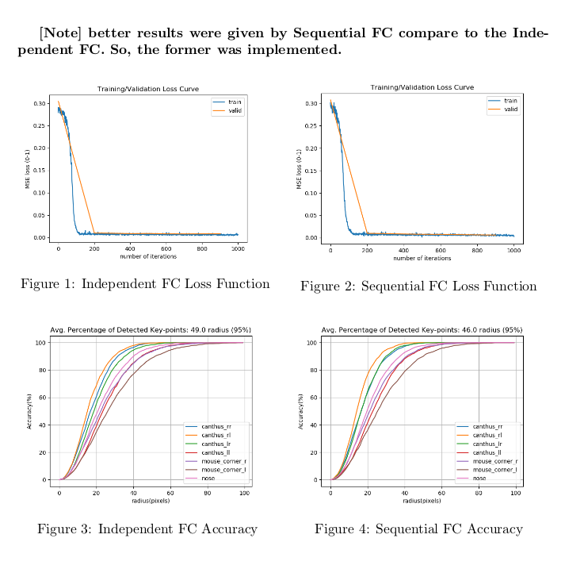
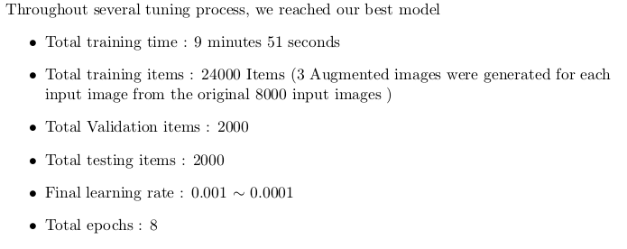
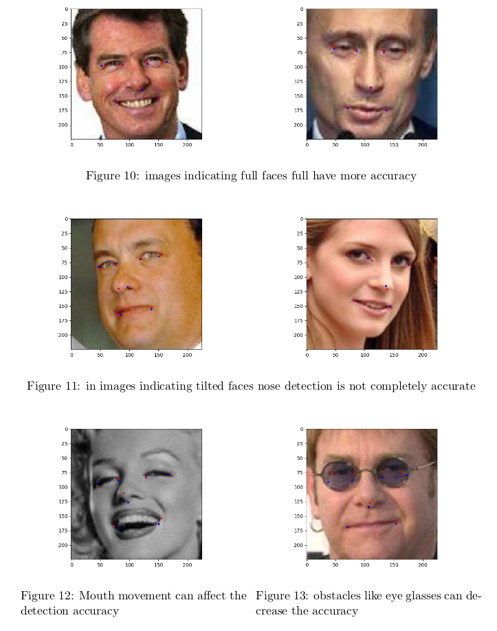

# Facial Landmark Regression
With Face dataset, we trained the deep neural network to detect facial landmarks. 

## Getting Started

### Dataset
Labeled Faces in the Wild (LFW): http://vis-www.cs.umass.edu/lfw/ \
Landmark Annotation with: http://cmp.felk.cvut.cz/~uricamic/flandmark/

## Result
### 1. Network Desing

### 2. Data Augmentation

### 3. Experiments
\
\

### 4. Results
\
\

## Author

Suhong Kim – [@github](https://github.com/suhongkim) – suhongkim11@gmail.com \
Distributed under the MIT license. See the [LICENSE.md](LICENSE.md) file for details

This project is done with [Sara Jalili](https://www.linkedin.com/in/sara-jalili/?originalSubdomain=ca)
 
## Inspiration
This project is done  for CMPT742(Fall2018) at SFU. 
